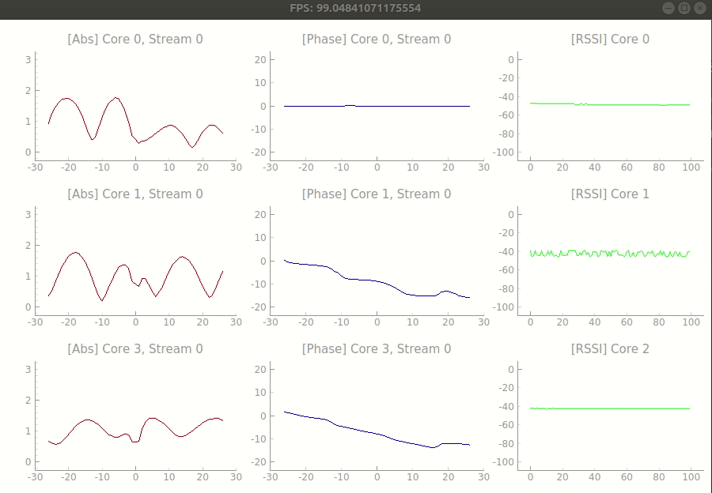

# Realtime Nexmon CSI Visualizer 

This repo contains the data collection tool used in the following paper: <br/>
> **[Exploring Practical Vulnerabilities of Machine Learning-based Wireless Systems](https://www.usenix.org/conference/nsdi23/presentation/liu-zikun)**  
> Zikun Liu, Changming Xu, Emerson Sie, Gagandeep Singh, Deepak Vasisht   
> *USENIX Networked Systems Design and Implementation (**NSDI**), 2023* 
>

[Nexmon Channel State Information Extractor](https://github.com/seemoo-lab/nexmon_csi) can be used to extract CSI of OFDM-modulated WIFI frames (802.11a/(g)/n/ac) on a per frame basis with up to 80 MHz bandwidth on Broadcom WiFi Chips.

This repo contains an convenient Python utility for decoding and displaying CSI from a Nexmon device (e.g. ASUS RT-AC86U) in real time (up to ~100 Hz on a typical desktop CPU). It is ideal for real time applications such as on-the-fly debugging, gesture sensing, etc.

https://user-images.githubusercontent.com/14133352/214341753-4fc49b61-f244-4158-abc5-3d0a84440746.mp4

### Features

- Primarily for ASUS RT-AC86U, but works for other devices (RPi4b+, Nexus 6P) with a little modification.
- Supports 4 x 4 cores and spatial streams simultaneously at ~100 Hz on typical desktop CPU.
- Includes per-core RSSI [issue #93](https://github.com/seemoo-lab/nexmon_csi/issues/93) to deal with AGC.
- Shows relative phase difference to first core [issue #219](https://github.com/seemoo-lab/nexmon_csi/issues/219)

### Requirements

- **Host**, where you wish to receive CSI data (tested on Ubuntu 18.04).
- **Monitor** (RT-AC86U AP), where CSI data collection occurs.
  - This router contains bcm4366c0 WIFI Chip. bcm4366e is a updated version and it also works.
  - Set the username of the router to be `admin` in the login page.
  - Setup SSH keys
    - Run `ssh-keygen -t ed25519` and generate a SSH Key. You can use the default settings.
    - Login to the router Web interface.
    - In Advanced > Administration > System:
      - Enable SSH
      - Copy paste the key from ~/.ssh/id_ed25519.pub
    - Ensure that the router login name is admin. The makefiles need this.
    - Test that the VM is able to ssh into the router
    - `ssh admin@<RT AC86Us IP>` this should happen without asking for a password.
- **Client**, whose transmissions we want to monitor.

### Basic Setup 

Connect a host (desktop/laptop) to the AP through an Ethernet port. Connect a client to some other WIFI network, e.g., your home WLAN (NOT the AP).

### Host Setup

- Setup the conda environment `conda env create -f env.yaml` and activate the environment with `conda activate csi_visualizer`.
- Make the binaries under `utils/` folder by running `make`. This should create an executable `makecsiparams` and library `unpack_float_py.so`.

### Monitor Setup

- For convenience, we have precompiled binaries under the `nexmon_compiled/` folder.
  - This folder contains the nexmon core firmware `dhd.ko`, `nexutil`, `makecsiparams` and `tcpdump`.
  - The vanilla Nexmon from official repo doesn't support RSSI extraction which makes the CSI amplitude meaningless. We use the workaround detailed in [issue #126](https://github.com/seemoo-lab/nexmon_csi/issues/126).
- Copy the contents to the `/jffs/` partition of your router: `scp ./nexmon_compiled/* admin@<routers-ip>:/jffs/`
- Make `nexutil`, `makecsiparams`, and `tcpdump` executable: `ssh admin@<routers-ip> "/bin/chmod +x /jffs/nexutil /jffs/mcp /jffs/tcpdump "`

### Run CSI Collection

- Take note of the monitor IP, client MAC, and channel in which the client is transmitting (this can usually be found using `iwlist` on the client).
- Generate traffic on your client device somehow, for example using:
  ```
  sudo ping -i 0.1 <gateway ip address>
  ```
- Run `main.py` with the appropriate arguments. For example
    ```bash
    ./main.py --monitor_ip=192.168.10.1 --clients=b0:7d:64:af:ea:ec --chan_spec=40/20
    ```

    and you will get the real-time CSI collection like this:

    

    - Each row corresponds to a different core (antenna) and column to a different spatial stream. CSI amplitudes are in red, phases are in blue, and RSSI (dBm) is in green.

## Citation

If you find this work and/or dataset useful in your research, please cite:

```
@inproceedings {liu2023exploiting,
author = {Zikun Liu and Changming Xu and Emerson Sie and Gagandeep Singh and Deepak Vasisht},
title = {Exploring Practical Vulnerabilities of Machine Learning-based Wireless Systems},
booktitle = {20th USENIX Symposium on Networked Systems Design and Implementation (NSDI 23)},
year = {2023},
isbn = {978-1-939133-33-5},
address = {Boston, MA},
pages = {1801--1817},
url = {https://www.usenix.org/conference/nsdi23/presentation/liu-zikun},
publisher = {USENIX Association},
month = apr,}
```
